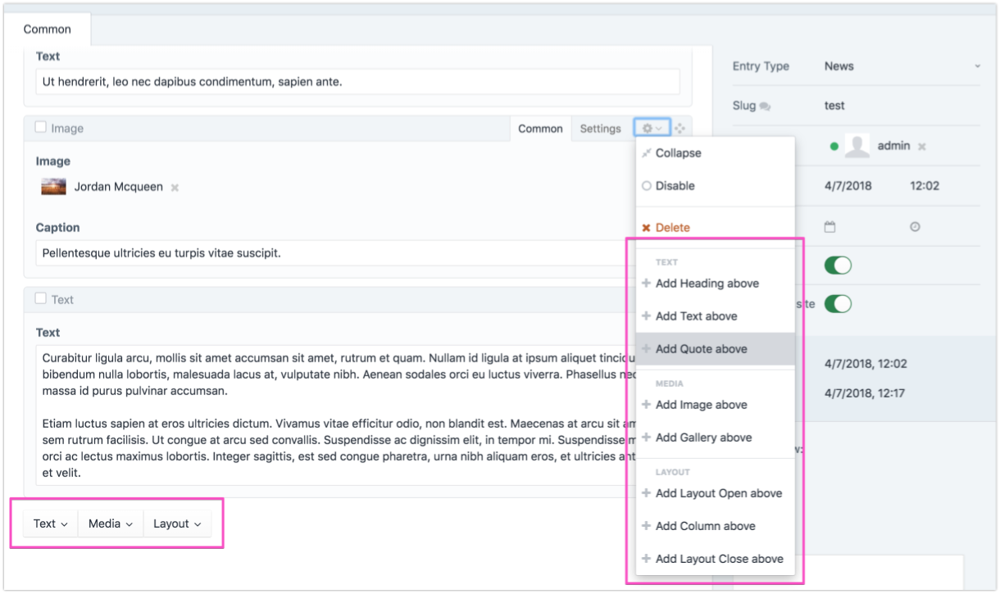
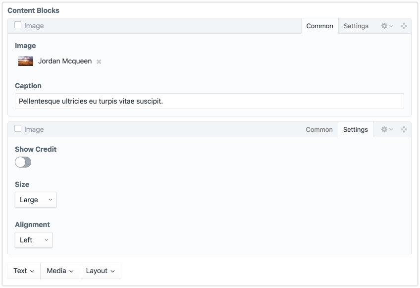
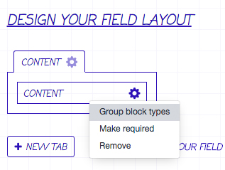
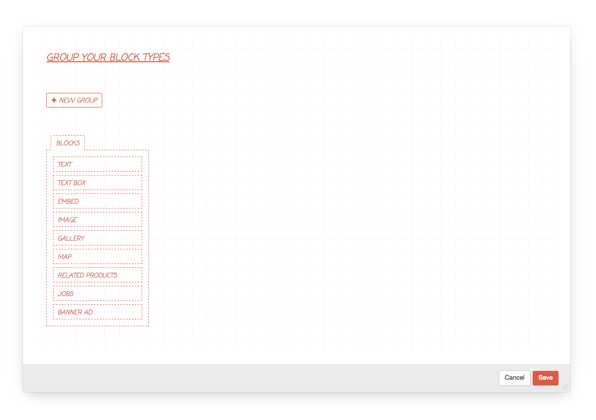
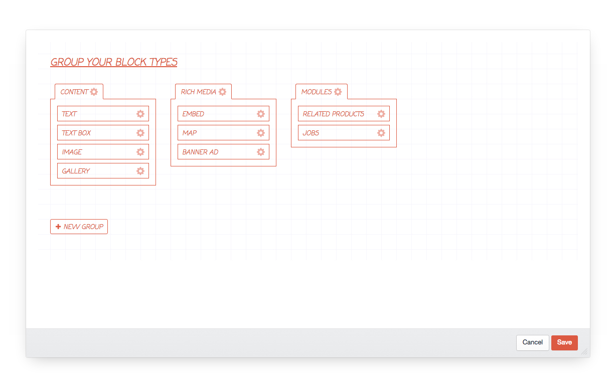
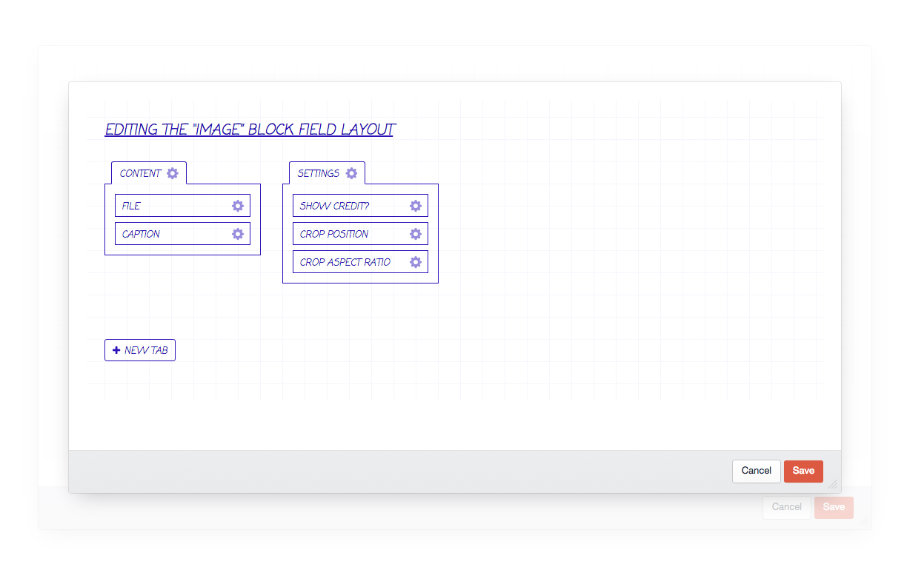
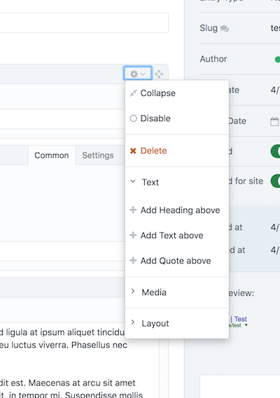

  

# Spoon

Enhance your Matrix fields with groups, tabs and more!

Use Spoon to group Matrix blocks, hide blocks and / or fields, and organise your block layouts with tabs.

Spoon never touches your content, it is simply a layer on top of the core Matrix field type, so if you ever don’t want it you can just take the blue pill and uninstall it.

Or is it the red pill. Which is the real illusion?!

**Now works with [Super Table](https://verbb.io/craft-plugins/super-table)!**

Get inception heavy with either a Matrix inside a Super Table or go wild and nest that Super Table in _another_ Matrix for more fun.

---

**Note:** The license fee for this plugin is $59 via the Craft Plugin Store.

## Requirements

This plugin requires Craft CMS 3.0.15 or later.

## Installation

To install the plugin, follow these instructions.

1. Open your terminal and go to your Craft project:

        cd /path/to/project

2. Then tell Composer to load the plugin:

        composer require angellco/spoon

3. In the Control Panel, go to Settings → Plugins and click the “Install” button for Spoon.

## Overview

Organise long lists of blocks into smaller groups for clearer selection.

Arrange fields into tabbed groups on each block type.

Use just one Matrix field and hide and show blocks or fields based on the Entry Type, Category Group and more.

### Roadmap

If you wish to keep up with the progress of this project you can do so in the [GitHub project](https://github.com/angell-co/Spoon/projects/2).

### Support

All support requests should be submitted via [GitHub issues](https://github.com/angell-co/Spoon/issues), if you need more in-depth help then please do reach out to me on the [Craft Slack](https://craftcms.com/community#slack) (@joshangell) or email me - [josh@angell.io](mailto:josh@angell.io). 

## Usage

The way Spoon works is by allowing you to create your block type groups and field layouts in multiple contexts.

Say you have a large Matrix field that drives a lot of the content on your site, you want it to work the same way across most of the control panel but there are often a couple of places you just want to tweak it. You might want an extra block type for a specific section, or to not show certain fields somewhere as they aren’t applicable in that context.

We enable this to happen by making use of contexts. Each time the code runs that manipulates the output of your Matrix fields we check the context of the page to see if there is any specific configuration for that context and if not fall back to any defaults you may have set.

The following contexts are currently supported:

* Entry Types
* Category Groups
* Global Sets
* Users

You can override your defaults for a specific context by going to the field layout designer for each one, clicking the gear icon of any active Matrix field and selecting “Group block types”:

### Setting up defaults

To create default block type groups and field layouts for all your Matrix fields go to Settings → Spoon. Here you will find a list of your current Matrix fields.

Click a field name to launch the block type groups editor. It should look something like this:

Now you can group your block types in the same way that you create a field layout for a section:

If you leave any block types off then they won’t be shown.

Once you have some groups you can go one step further and customize the field layout for a particular block - just click the gear icon and select ‘Edit field layout’.

Thats it! You should now be able to browse to somewhere that uses that field and see your new groups and field layouts in action.

### Config settings

Spoon supports the standard config.php multi-environment friendly config file for the plugin settings. Just copy the config.php to your Craft config/ directory as spoon.php and you can configure the settings in a multi-environment friendly way.

* `nestedSettings` - set this to an array of Matrix field handles that should use the nested settings menu display mode:

---

Brought to you by [Angell & Co](https://angell.io)

This project used to live under a [different name](https://github.com/angell-co/Pimp-My-Matrix) in Craft 2, but I renamed it for obvious reasons.

Big thanks to the lovely people at [Supercool](https://github.com/supercool) for letting me take this project over.
